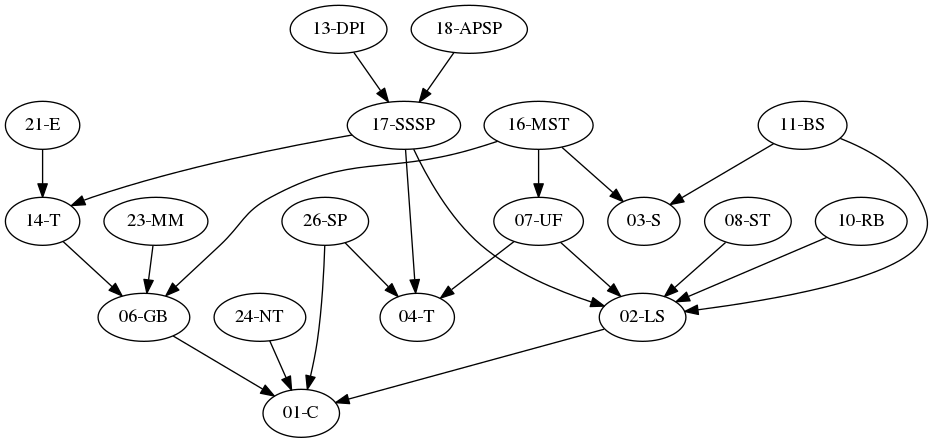

# beOI/beCP Training Resources
This repository hosts all the course materials created for the [beOI](http://beoi.be-oi.be/) (Belgian Olympiad in Informatics) and [beCP](http://becp.be-oi.be/) (Belgian Competitive Programming) training camps. Remember though that _You don't need advanced topics for bronze and maybe even for silver_ (Bruno Ploumhans, 2018, _Line 21_).

The program is now structured into a set of teaching units, designed to cover the whole IOI syllabus (and some additional material from the [CP3](http://cpbook.net/) book). Each unit contains the slides used and a README which outlines the content of the unit, lists the prerequisites and gives links to related exercises. The units are not originally meant to be in a logical order.

The resources made prior to the units system are available in the [archive](archive) directory.

## Teaching units
Here is the list of completed and planned teaching units. As they are still under construction, the units might not contain all the topics mentioned in the parentheses.

1. [Algorithms and complexity](01-complexity) (big oh, practical limits)
2. [Linear data structures](02-linear-struct) (array, bitset, vector, linked list, stack, queue)
3. [Sorting algorithms](03-sorting) (selection, insertion, merge, quick)
4. [Tree data structures](04-trees) (set, map, heap)
5. Balanced binary search tree (treap, red-black, order statistics with library)
6. [Graph basics and representation](06-graph-basics) (adjacency matrix, adjacency list)
7. [Union-find structure](07-union-find)
8. [Segment tree](08-segment-tree) (regular, lazy)
9. [Fenwick tree](09-fenwick-tree) (binary indexing, least significant bit)
10. [Recursive backtracking](10-recursive-backtracking) (pruning, bitmasks)
11. [Binary search](11-binary-search) (nontrivial applications, binary search the answer)
12. [Greedy](12-greedy) (basic idea, coin change, load balancing, interval scheduling)
13. [Dynamic programming I](13-dynamic-programming-i) (top-down, bottom-up, classical problems)
14. [Graph traversal](14-traversal) (DFS, BFS, toposort, bipartite check, Kosaraju SCC)
15. [Specialized DFS](15-special-dfs) (cycle check, articulation point, bridge, Tarjan SCC)
16. [Minimum spanning tree](16-minimum-spanning-tree) (Kruskal, Prim, variants, minimax/maximin path)
17. [Single-source shortest path](17-single-source-shortest-path) (review BFS, Dijkstra, Bellman-Ford)
18. [All-pairs shortest path](18-all-pairs-shortest-path) (Floyd-Warshall, applications)
19. [Network flow](19-network-flow) (Edmonds-Karp, min cut, vertex capacity, vertex/edge-disjoint paths, MCMF)
20. Directed acyclic graph (longest/shortest/counting paths, tree MVC)
21. [Eulerian path](21-eulerian) (eulerian check, finding the path/cycle, Chinese postman problem)
22. [Bipartite graph and MCBM](22-bipartite) (augmenting path algorithm, MIS, MVC, min path cover on DAG)
23. [Miscellaneous math](23-misc-math) (fast pow, Fibonacci, powers of adjacency matrix, tortoise and hare)
24. [Number theory](24-number-theory) (GCD, prime factors, sieve, extended Euclid)
25. [Game theory](25-game-theory) (subtraction/Nim game, minimax, alpha-beta)
26. [String processing](26-string-processing) (trie, Rabin-Karp, Z-algorithm, KMP)
27. [Computational geometry](27-computational-geometry) (basics, polygon area, convex hull)
28. Advanced search techniques (heavy pruning, meet in the middle, A*)
29. Dynamic programming II (bitmask, drop one parameter, bitonic TSP, sliding window)
30. Problem decomposition
31. Advanced graph problems (2-SAT, MWIS (tree, bipartite))
32. Sparse table, lowest common ancestor

